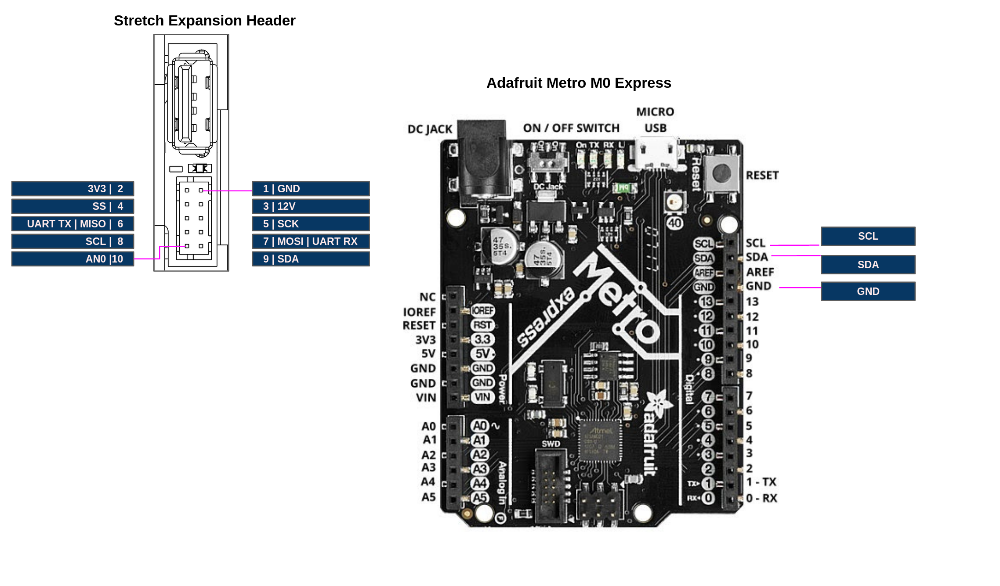

**NOTE** It is possible to brick the Wacc board by incorrectly configuring the hardware peripherals of the SAMD uC. Therefore, when integrating your custom hardware into the Wacc we strongly recommend emulating the Wacc board until the functionality is complete. The tutorial [Wacc Emulation](./tutorial_wacc_emulation.md) describes how to configure an Adafruit Metro M0 Express to behave as a stand-in for a Wacc board.

**NOTE**: These tutorials may require the latest version of Stretch Body. If necessary, please update your install.

# Integrating an I2C Device

This tutorial illustrates the integration of a I2C device on to the [Wrist Expansion header](https://docs.hello-robot.com/hardware_user_guide/#wrist). It extends t. We recommend doing the [Data Transfer](./tutorial_data_transfer.md) tutorial first. 

# Calculator via I2C

In this tutorial we will run the calculator from the [Data Transfer](./tutorial_data_transfer.md) tutorial on an Adafruit Metro M0 Express (Arduino Zero) that is running as an I2C slave. It will take a calculator `Command` from the Wacc and return the result in `Status` message. 




### Flash Firmware

First, program the Metro with the provided sketch, [zero_wacc_i2c](https://github.com/hello-robot/stretch_firmware/tree/master/tutorials/arduino/zero_wacc_i2c). Be sure to:

* Select the board's port from the IDE under Tools/Port
* Select the board 'Arduino UNO' from the IDE under Tools/Board


Next, program the Wacc with the provided sketch, [hello_wacc_i2c](https://github.com/hello-robot/stretch_firmware/tree/master/tutorials/arduino/hello_wacc_i2c). Be sure to:

* Select the board's port from the IDE under Tools/Port
* Select the board 'Adafruit M0 Express' from the IDE under Tools/Board

### Code Walk-through

The code is straightforward and is a natural extension of the code described in the  [Data Transfer](./tutorial_data_transfer.md) tutorial. A few sections to highlight in the  [hello_wacc_i2c](../arduino/hello_wacc_i2c) sketch are:


In`setupWacc()` we add code to configure the I2C. 

```c
Wire.begin(); 
```

In `Wacc.cpp` we add the I2C code:

```c
#include <Wire.h>

uint8_t i2c_out[9];   //I2C data out
uint8_t i2c_in[9];    //I2C data in
uint8_t ds_i2c_cnt=0; //Down sample counter
float FS_I2C = 10;    //Rate to run transactions (Hz)
int buf_idx=0;

void i2cTransaction()
{
  //Send the commmand
  memcpy(i2c_out, (uint8_t *) (&cmd.calc), sizeof(Calc_Command));
  Wire.beginTransmission(4); // transmit to device #4
  for(int i=0;i<sizeof(Calc_Command);i++)
  {
    Wire.write(i2c_out[i]);
  }
  Wire.endTransmission();    

  //Get the result
  Wire.requestFrom(4, sizeof(Calc_Status));
  int buf_idx=0;
  while (Wire.available() && buf_idx<sizeof(Calc_Status)) // loop through all but the last
  {
    uint8_t x = Wire.read();      
    i2c_in[buf_idx++]=x;
  }
  memcpy((uint8_t *) (&stat.calc),i2c_in,  sizeof(Calc_Status));
}
```

Here, the 9 bytes of the `Calc_Command` are transferred out and the 4 bytes of the `Calc_Status` are received. 

**Note: This simple communication protocol is not robust to handshaking errors, etc**

**Note: The Wacc uses I2C to also communicate with its onboard accelerometer** --  the [ADXL343](https://www.analog.com/media/en/technical-documentation/data-sheets/ADXL343.pdf).  In our example we are using I2C address `4` to communicate with our Metro slave. The ADXL343 is configured to use addrex `0xA6` for a write and `0xA7` for a read.

Finally, we call the `i2cTransaction()` function at a rate of `FS_I2C` by adding to `stepWaccController()`:

```c
 if (ds_i2c_cnt++ >= (FS_CTRL / FS_I2C))
  {
    ds_i2c_cnt = 0;
    i2cTransaction();
  }
```

### Wire Up the Boards

Next, wire the Metro to the Expansion Header as:

| Stretch Expansion Header | Uno  |
| ------------------------ | ---- |
| SCL                      | SCL  |
| SDA                      | SDA  |
| GND                      | GND  |

### Test the Calculator

Now, test the setup using the provided tool, [stretch_wacc_calc_jog.py](https://github.com/hello-robot/stretch_firmware/tree/master/tutorials/python/stretch_wacc_calc_jog.py). As shown below, The Metro performs the calculation of 12*13 and the result is report back to Stretch Body.

```bash
hello-robot@stretch-re1-100x:~$ cd repos/stretch_firmware/tutorial/python/
hello-robot@stretch-re1-100x:~/repos/stretch_firmware/tutorial/python$ ./stretch_wacc_calc_jog.py 
------ MENU -------
m: menu
r: reset board
a: set D2 on
b: set D2 off
c: set D3 on
d: set D3 off
X: do calculation
-------------------
X
---Calculate Op(Var1,Var2) ---
Op=0: Add
Op=1: Mult
Op=2: Div
Enter Op
1
Enter Var1
12
Enter Var2
13
------ MENU -------
m: menu
r: reset board
a: set D2 on
b: set D2 off
c: set D3 on
d: set D3 off
X: do calculation
-------------------

------------------------------
Ax (m/s^2) 0.0488623343408
Ay (m/s^2) 0.155020624399
Az (m/s^2) -10.0049753189
A0 349
D0 (In) 0
D1 (In) 1
D2 (Out) 70
D3 (Out) 0
Single Tap Count 26
State  0
Debug 0
Timestamp 1591588745.27
Board version: Wacc.Guthrie.V1
Firmware version: Wacc.v0.0.1pMySPI
Calc: 156.0
------ MENU -------
m: menu
r: reset board
a: set D2 on
b: set D2 off
c: set D3 on
d: set D3 off
X: do calculation
-------------------

```
------
<div align="center"> All materials are Copyright 2022 by Hello Robot Inc. Hello Robot and Stretch are registered trademarks. The Stretch RE1 and RE2 robots are covered by U.S. Patent 11,230,000 and other patents pending.</div>

