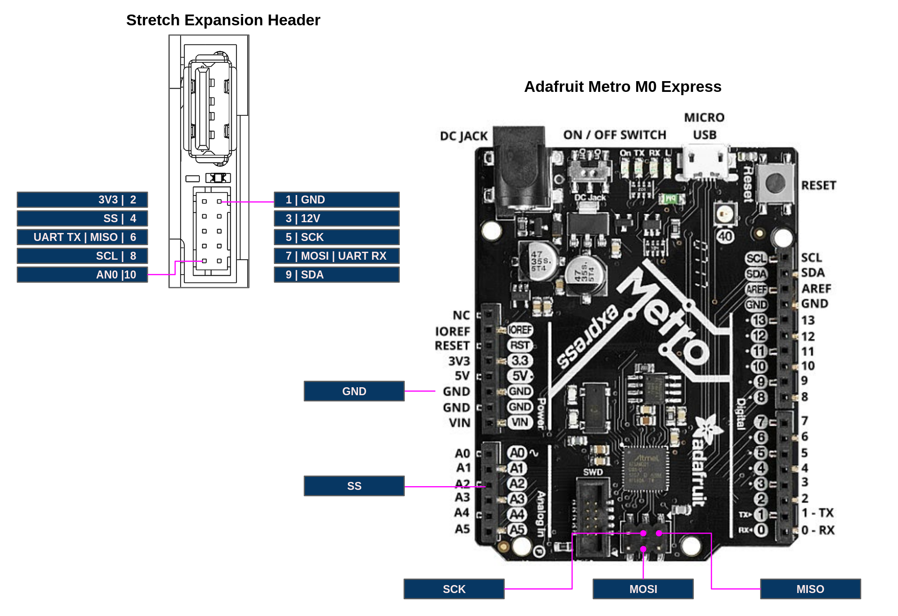

**NOTE** It is possible to brick the Wacc board by incorrectly configuring the hardware peripherals of the SAMD uC. Therefore, when integrating your custom hardware into the Wacc we strongly recommend emulating the Wacc board until the functionality is complete. The tutorial [Wacc Emulation](./tutorial_wacc_emulation.md) describes how to configure an Adafruit Metro M0 Express to behave as a stand-in for a Wacc board.

**NOTE**: These tutorials may require the latest version of Stretch Body. If necessary, please update your install.

# Integrating an SPI Device

This tutorial illustrates the integration of a SPI device on to the [Wrist Expansion header](https://docs.hello-robot.com/0.2/stretch-hardware-guides/docs/hardware_guide_re2/#wrist-expansion-header). It extends the [Data Transfer](./tutorial_data_transfer.md) tutorial. We recommend doing this tutorial prior to doing this one.

# Calculator via SPI

In this tutorial we will run the calculator from the [Data Transfer](./tutorial_data_transfer.md) tutorial on an Adafruit Metro M0 Express (Arduino Zero) that is running as an SPI slave. It will take a calculator `Command` from the Wacc and return the result in `Status` message. 



### Flash Firmware

First, program the Metro with the provided sketch, [zero_wacc_spi](https://github.com/hello-robot/stretch_firmware/tree/master/tutorials/arduino/zero_wacc_spi). Be sure to:

* Select the board's port from the IDE under Tools/Port
* Select the board 'Adafruit M0 Express' from the IDE under Tools/Board


Next, program the Wacc with the provided sketch, [hello_wacc_spi](https://github.com/hello-robot/stretch_firmware/tree/master/tutorials/arduino/hello_wacc_spi). Be sure to:

* Select the board's port from the IDE under Tools/Port
* Select the board 'Hello Wacc' from the IDE under Tools/Board

### Code Walk-through

The code is straightforward and is a natural extension of the code described in the  [Data Transfer](./tutorial_data_transfer.md) tutorial. A few sections to highlight in the  [hello_wacc_spi](https://github.com/hello-robot/stretch_firmware/tree/master/tutorials/arduino/hello_wacc_spi) sketch are:

First, in the sketch `setup()` we configure the slave select pin to be an output

```c
pinMode(HEADER_SPI_SS,OUTPUT);
```

Next in `setupWacc()` we add code to configure the SPI

```c
SPISettings settingsA(100000, MSBFIRST, SPI_MODE1);
SPI.begin();
SPI.beginTransaction(settingsA);
```

In `Wacc.cpp` we add the SPI code:

```c
#include <SPI.h>

uint8_t spi_out[9];   //SPI data out
uint8_t spi_in[9];    //SPI data in
uint8_t ds_spi_cnt=0; //Down sample counter
float FS_SPI = 10;    //Rate to run transactions (Hz)

void spiTransaction()
{
  digitalWrite(HEADER_SPI_SS, LOW);
  SPI.transfer('X'); //Mark start of transaction
  memcpy(spi_out, (uint8_t *) (&cmd.calc), sizeof(Calc_Command));
  for (uint8_t idx = 0; idx < 9; idx++)
    spi_in[idx] = SPI.transfer(spi_out[idx]);
  digitalWrite(HEADER_SPI_SS, HIGH);
  memcpy((uint8_t *) (&stat.calc),spi_in+1,  sizeof(Calc_Status));
}
```

Here, the 9 bytes of the `Calc_Command` are transferred out and the 4 bytes of the `Calc_Status` are received. 

**Note: This simple communication protocol is not robust, using an 'X' to demarcate the start of a transaction**

Finally, we call the `spiTransaction()` function at a rate of `FS_SPI` by adding to `stepWaccController()`:

```c
 if (ds_spi_cnt++ >= (FS_CTRL / FS_SPI))
  {
    ds_spi_cnt = 0;
    spiTransaction();
  }
```

### Wire Up the Boards

Next, wire the Metro to the Expansion Header as:

| Stretch Expansion Header | Uno  |
| ------------------------ | ---- |
| SS                       | SS   |
| MISO                     | MISO |
| MOSI                     | MOSI |
| SCK                      | SCK  |
| GND                      | GND  |

**Note: Other Arduino boards can be used. However 5V Arduinos boards will need their SPI lines level shifted to 3V3.**

### Test the Calculator

Now, test the setup using the provided tool, [stretch_wacc_calc_jog.py](https://github.com/hello-robot/stretch_firmware/tree/master/tutorials/python/stretch_wacc_calc_jog.py). As shown below, The Arduino Uno performs the calculation of 12*13 and the result is report back to Stretch Body.

```bash
hello-robot@stretch-re1-100x:~$ cd repos/stretch_firmware/tutorial/python/
hello-robot@stretch-re1-100x:~/repos/stretch_firmware/tutorial/python$ ./stretch_wacc_calc_jog.py 
------ MENU -------
m: menu
r: reset board
a: set D2 on
b: set D2 off
c: set D3 on
d: set D3 off
X: do calculation
-------------------
X
---Calculate Op(Var1,Var2) ---
Op=0: Add
Op=1: Mult
Op=2: Div
Enter Op
1
Enter Var1
12
Enter Var2
13
------ MENU -------
m: menu
r: reset board
a: set D2 on
b: set D2 off
c: set D3 on
d: set D3 off
X: do calculation
-------------------

------------------------------
Ax (m/s^2) 0.0488623343408
Ay (m/s^2) 0.155020624399
Az (m/s^2) -10.0049753189
A0 349
D0 (In) 0
D1 (In) 1
D2 (Out) 70
D3 (Out) 0
Single Tap Count 26
State  0
Debug 0
Timestamp 1591588745.27
Board version: Wacc.Guthrie.V1
Firmware version: Wacc.v0.0.1pMySPI
Calc: 156.0
------ MENU -------
m: menu
r: reset board
a: set D2 on
b: set D2 off
c: set D3 on
d: set D3 off
X: do calculation
-------------------

```

------
<div align="center"> All materials are Copyright 2022 by Hello Robot Inc. Hello Robot and Stretch are registered trademarks. The Stretch RE1 and RE2 robots are covered by U.S. Patent 11,230,000 and other patents pending.</div>

